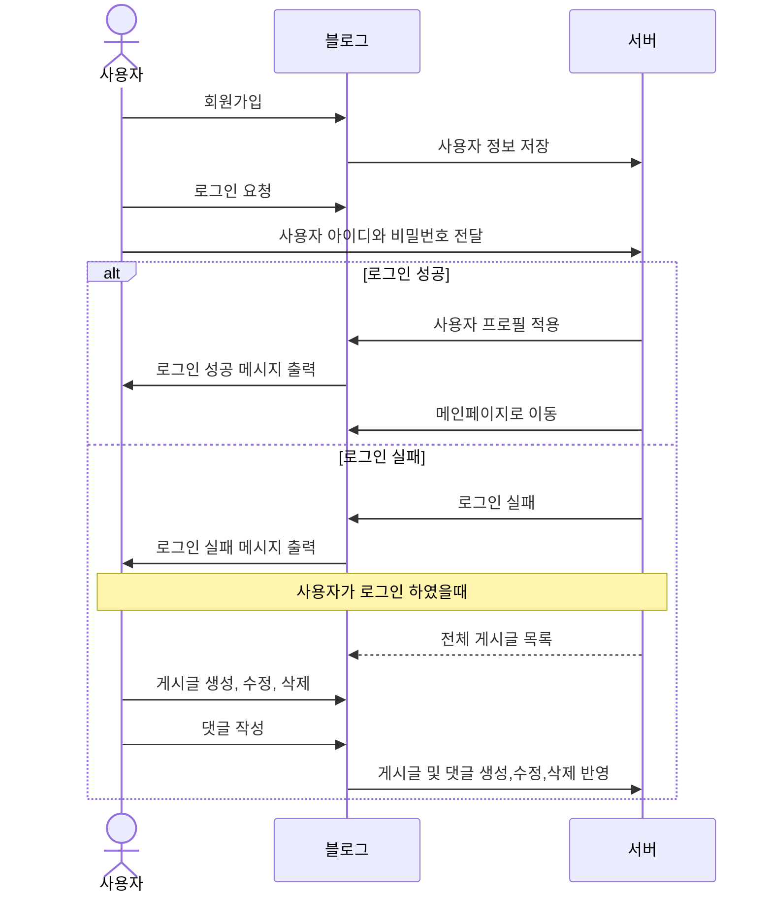
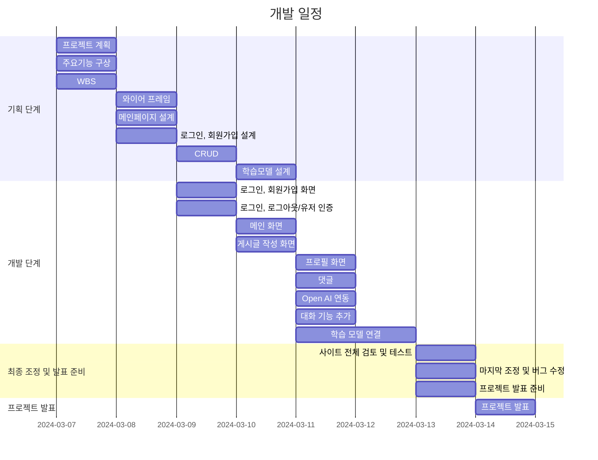

# 블로

## 1. 목표와 기능

### 1.1 목표

- Django를 활용한 블로그 설계

### 1.2 기능

- 로그인, 회원가입
- 게시글 작성, 수정, 삭제
- 댓글 작성, 수정, 삭제
- 프로필

## 2. 개발 환경 및 배포 URL

### 2.1 개발 환경
- 사용 툴
    - VSCode
- 사용 언어
    - HTML
    - CSS
    - JS
    - Python
- Web Framework
    - Django 5.0.2

### 2.2 배포 URL
-미완성

## 3. 요구사항 명세와 기능 명세

## 4. 프로젝트 개발 일정

### 4.1 개발 일정(WBS)
* 아래 일정표는 머메이드로 작성했습니다.
