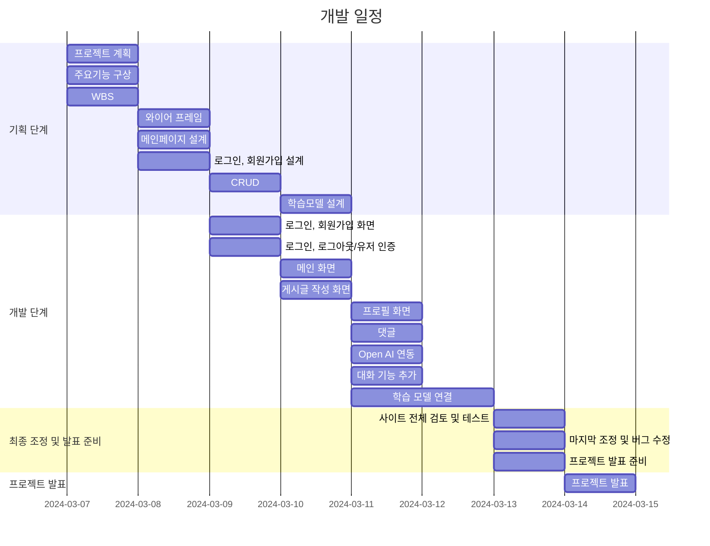

# 

## 1. 목표와 기능

### 1.1 목표

- 

### 1.2 기능

- 
- 
- 

## 2. 개발 환경 및 배포 URL

### 2.1 개발 환경
- 사용 툴
    - VSCode
- 사용 언어
    - HTML
    - CSS
    - JS
- 서비스 배포
    - GitHub Pages

### 2.2 배포 URL

## 3. 요구사항 명세와 기능 명세

## 4. 프로젝트 구조와 개발 일정

### 4.1 프로젝트 구조

### 4.2 개발 일정(WBS)
* 아래 일정표는 머메이드로 작성했습니다.
